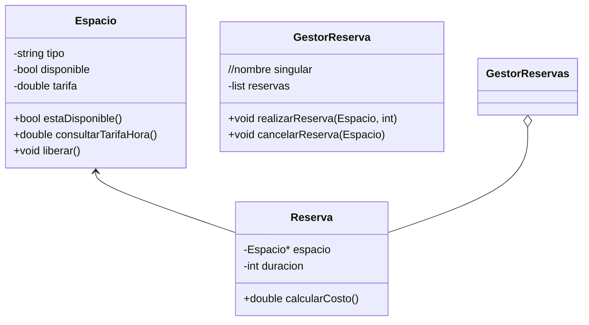

### ACTIVIDAD: Diseños propuestos
> Para cada diseño identificamos los errores, si los hay. Luego, Propusimos una solución corregida, explicada con comentarios.

##### Diseño uno
```mermaid
classDiagram    //todos los atributos pasan a privados
    class Espacio {
        -string tipo
        -bool disponible
        -double tarifa
	+bool estaDisponible()
        +double consultarTarifaHora()
        +void liberar()
        /* Se puede considerar un método diferente a bool para consultar disponibilidad, para ver mantenimientos o otras situaciones, pero no lo veo tan necesario*/
    }

    class Reserva {
        -Espacio* espacio
        -int duracion
        +double calcularCosto()
        // Comentario: Se agrega un método para comprobar si el espacio está disponible
        // durante la duración seleccionada (esto no se menciona en el diseño original, 
        // pero es útil para validar las reservas).
    }

    class GestorReserva { //Nombre en singular
        -list<Reserva> reserva
        +void realizarReserva(Espacio)
        +void cancelarReserva(Espacio)  /*Se podría considerar pasar un identificador de reserva o un objeto completo en lugar de solo un espacio en la cancelación de la reserva, para 					hacerla más precisa y evitar errores*/
        
    }

    Espacio --> Reserva
    GestorReservas --o Reserva
    
    // Sin cambios importantes en la relación, ya que está correcta.
```

##### Diseño dos

##### Diseño tres, Solución general o "la mas completa"
```mermaid
classDiagram	//Atributos públicos NO RECOMENDADOS
    class Espacio {
        -string tipo
        -bool disponible
        -int capacidad
        -double tarifa
        +bool estaDisponible()
        +double consultarTarifaHora()
        +void liberar()
    }

    class Reserva {
        -Espacio espacio
        -int duracion
        +double calcularCosto()
    }

    class GestorReserva { //Singular en clase gestionaReserva
        -list<Reserva> reservas
        +void realizarReserva(Espacio, int)
        +void cancelarReserva(Espacio)
    }

    Espacio <-- Reserva
    GestorReservas o-- Reserva
	//Flechas de herencia y composición apuntando de reserva a espacio y gestorReserva correspondientemente
```