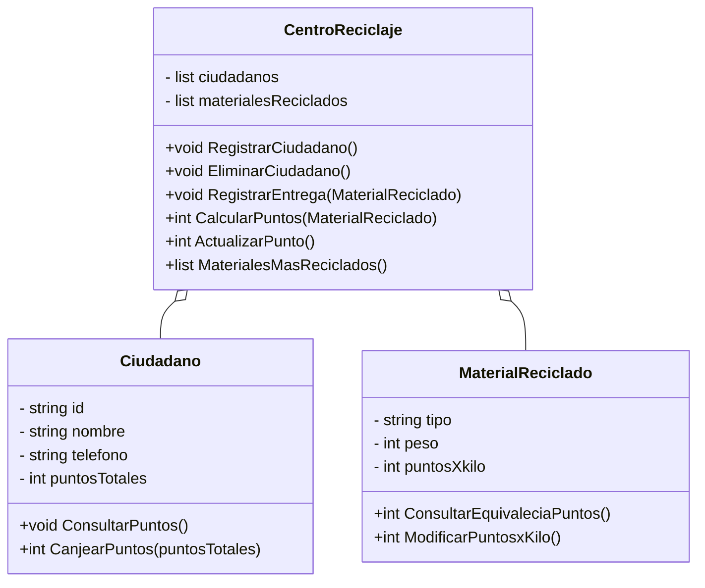

```mermaid
classDiagram
    
        class CentroReciclaje{
            - list ciudadanos
            - list materialesReciclados


            +void RegistrarCiudadano()
            +void EliminarCiudadano()
            +void RegistrarEntrega(MaterialReciclado)
            +int CalcularPuntos(MaterialReciclado)
            +int ActualizarPunto()
            +list MaterialesMasReciclados()

        }
        
        class Ciudadano {
            - string id
            - string nombre
            - string telefono
            - int puntosTotales

            +void ConsultarPuntos()
            +int CanjearPuntos(puntosTotales)

        }

        class MaterialReciclado{
            - string tipo
            - int peso
            - int puntosXkilo

            +int ConsultarEquivaleciaPuntos()
            +int ModificarPuntosxKilo()

        }

        CentroReciclaje o--Ciudadano
        CentroReciclaje o--MaterialReciclado

```

