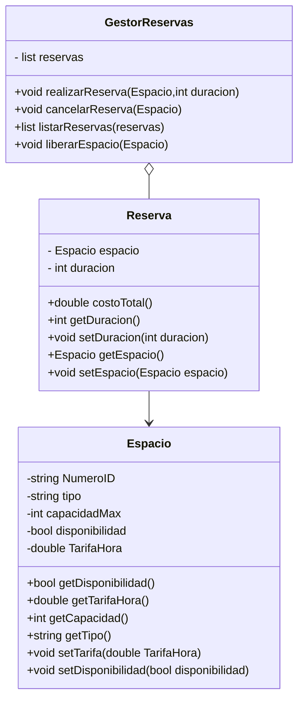

Elaborado por: Camilo Salazar 

# Observaciones de cada Diseño:#

## **Diseño 1:** ##

- Falta la capacidad maxima y el ID en la clase Espacio
- TODO SE ENCUENTRA PÚBLICO (hasta atributos)
- La relación entre espacio y reserva es al contrario: una reserva tiene un espacio
- falta método de consultar dispoibilidad
- Se podría especificar cuál es el entero que se requiere en el método realizarReserva (la duración)
- el símbolo "*" en atributo Espacio lo hace parecer un puntero cuando es una clase
- Hace falta un método para modificar la disponibilidad cuando se libere el espacio al cancelar la reserva
- No hay método para acceder al atributo tarifa de la clase Espacio para poder usarlo en el cálculo del costo. 
- La relación de 1 a todos entre el Gestor de reservas y reservas es al revés (1 gestor de reservas por muchas reservas)

## **Diseño 2:** ##

- TODO SIGUE SIENTO PÚBLICO (hasta los atributos)
- A la clase Espacio le falta el atributo ID y capacidad máxima
- El símbolo "*" en atributo Espacio lo hace parecer un puntero cuando es una clase
- No se encuentra el método de consultar disponibilidad de un espacio
- Se podría especificar cuál es el entero que se requiere en el método realizarReserva (duración)
- Hace falta un método  para modificar la disponibilidad cuando se libere el espacio al cancelar la reserva
- No hay método para acceder al atributo tarifa de la clase Espacio para poder usarlo en el cálculo del costo.

## **Diseño 3:** ##

- TODO ESTÁ PÚBLICO (ATRIBUTOS DEBERÍAN TENER SIMBOLO -)
- Falta atributo ID en clase Espacio
- Se podría especificar cuál es el entero que se requiere en el método realizarReserva (duración).
- Método liberar es de la clase Gestor no de Espacio

# Código en Mermaid del diagrama propuesto: # 

    

  

